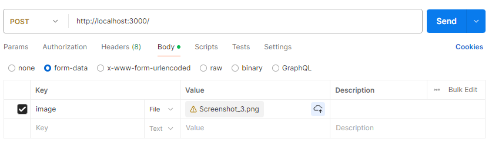

# Image Reader

Image Reader is an API that reads image content. It's useful when the copy function is disabled on the website you're visiting.

## Used technologies

- Node.js;
- Express;
- Tesseract.

## Example

## Author

João Victor Soares Faust
